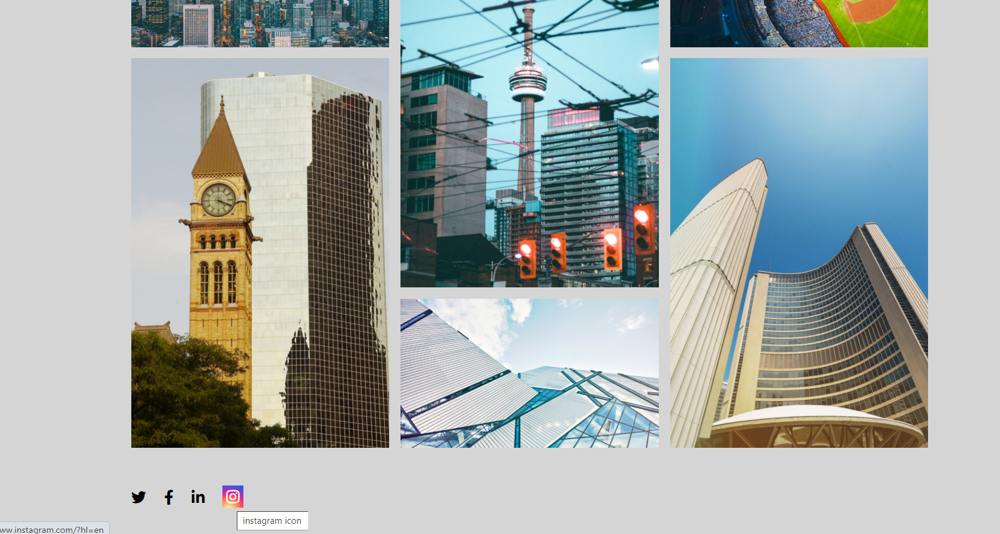

### Responsive Gallery images page (pure CSS)

2021-1-17

**Requirements:**

- "Open Sans" from Google Fonts - regular and bold
- a 1100px wide wrapper or container (this doesn't absolutely need to be 1100px, maybe you want to work with percentages...)
- a full bleed background colour (#d5d5d5).
- an overlay on hover of images (hint: try using a "to bottom right" linear gradient and percentages to get the triangle look!).
- font awesome icons in the footer, make sure these are links. Don't forget to include the "visually-hidden" class to make sure these links are accessible. They should also have a hover state, it could be a colour change or something else, or a combination.

**Feature:**

- Hover "Toronto" has shining animation effect.
- Landing page background using gradient instead of #d5d5d5.
- Keyboard tab highlight border for accessibility.
- Social icons add real links and also consider accessibility.
- Gallery image display using CSS Grid.
- Social icon layout using CSS Flex.
- Mobile friendly for all pages.
- In each image page, there is a shadow effect and link to my instagram home page.

 

 

 

 

**mobile version**
 

 

 

